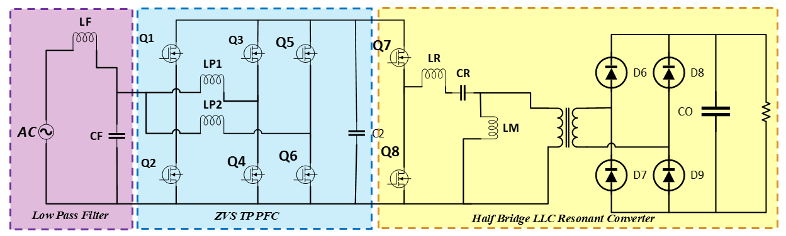

# EECE 474 — Group 5: Interleaved Boost PFC with Half-Bridge LLC Resonant Converter-Based EV Battery Charger

<p align="center">
  
</p>

<p align="center">
  
  
  
  
</p>

---

## Table of Contents

- [Project Overview](#project-overview)
- [System Architecture](#system-architecture)
- [Design Specifications](#design-specifications)
- [Stage 1 — Interleaved Boost PFC](#stage-1--interleaved-boost-pfc)
- [Stage 2 — Half-Bridge LLC Resonant Converter](#stage-2--half-bridge-llc-resonant-converter)
- [Key Waveforms](#key-waveforms)
- [Simulation Results](#simulation-results)
- [Repository Structure](#repository-structure)
- [How to Run the Simulation](#how-to-run-the-simulation)
- [Tools Used](#tools-used)
- [References](#references)
- [Authors](#authors)

---

## Project Overview

Electric Vehicle (EV) adoption is accelerating globally, making high-efficiency, high-power-density on-board battery chargers a critical area of power electronics research. This project designs and simulates a **two-stage AC-DC EV battery charger** that addresses the key challenges of:

- **Power quality** — near-unity power factor and low Total Harmonic Distortion (THD) at the AC mains
- **Galvanic isolation** — safe separation between the AC grid and the EV battery
- **High efficiency** — zero-voltage switching (ZVS) operation in the DC-DC stage
- **Regulated output** — stable DC voltage suitable for lithium-ion battery charging

The full system is modeled and simulated in **MATLAB Simulink**, with all circuit waveforms validated against theoretical expectations.

---

## System Architecture

```
 AC Mains (220V, 50Hz)
        │
        ▼
┌───────────────────────┐
│  Interleaved Boost    │   Stage 1: PFC
│  PFC Converter        │   → Unity power factor
│  (2 interleaved legs) │   → Low input current THD
└──────────┬────────────┘   → Regulated DC link (~400V)
           │
           ▼  DC Link Bus (~400V)
┌───────────────────────┐
│  Half-Bridge LLC      │   Stage 2: Isolated DC-DC
│  Resonant Converter   │   → G